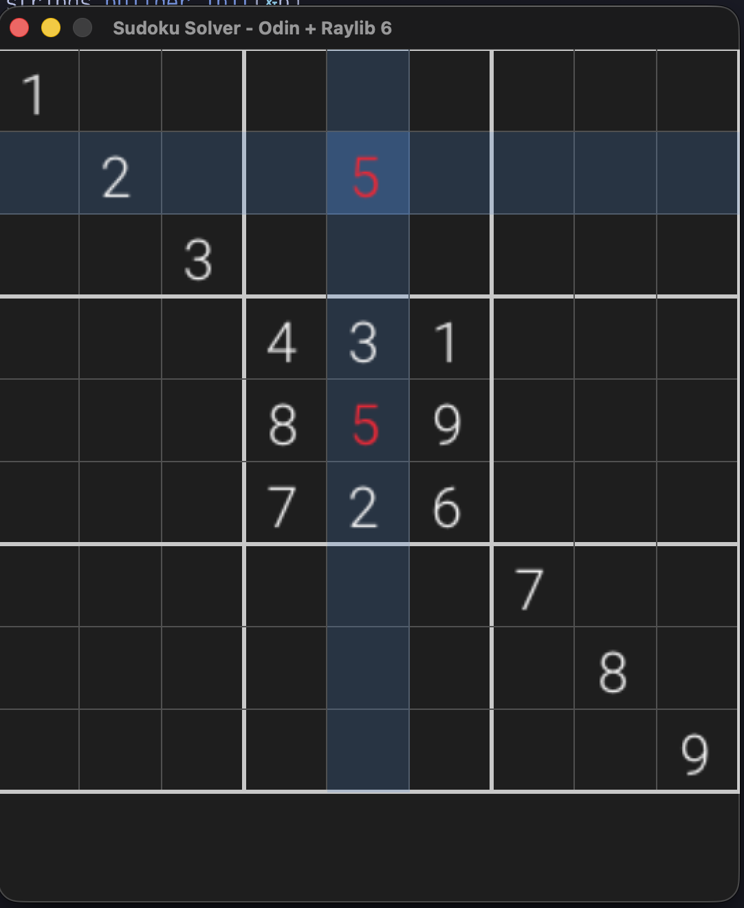
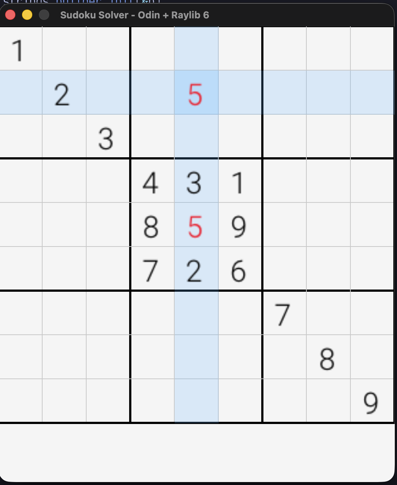
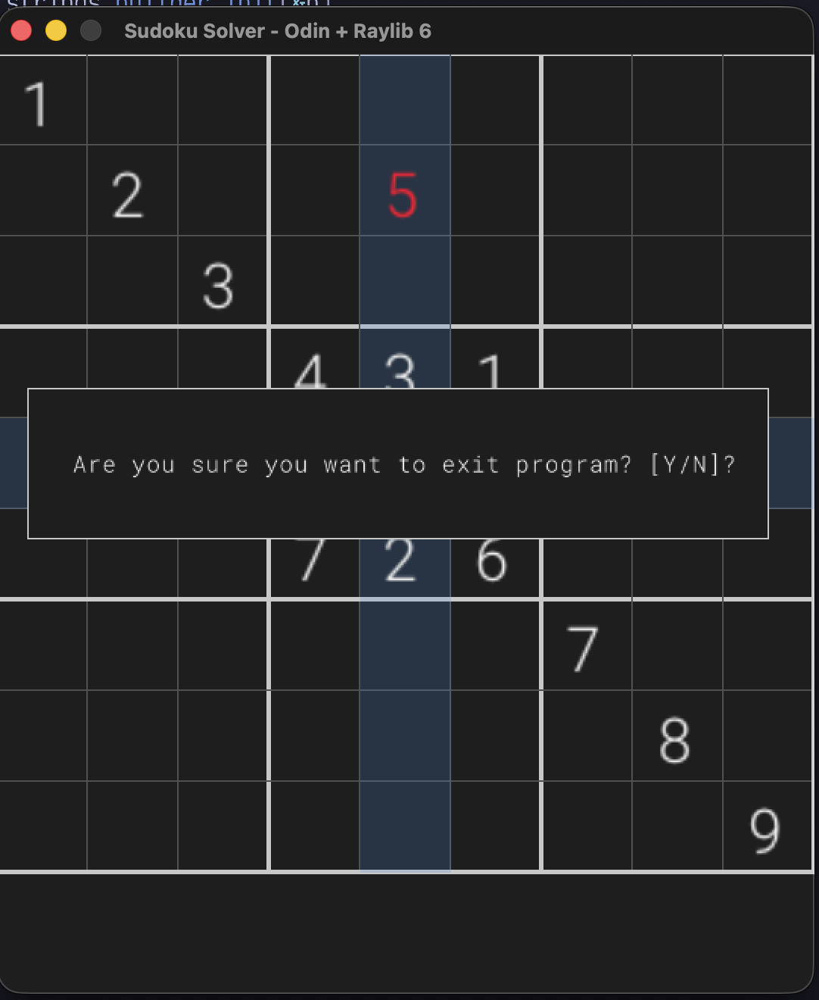
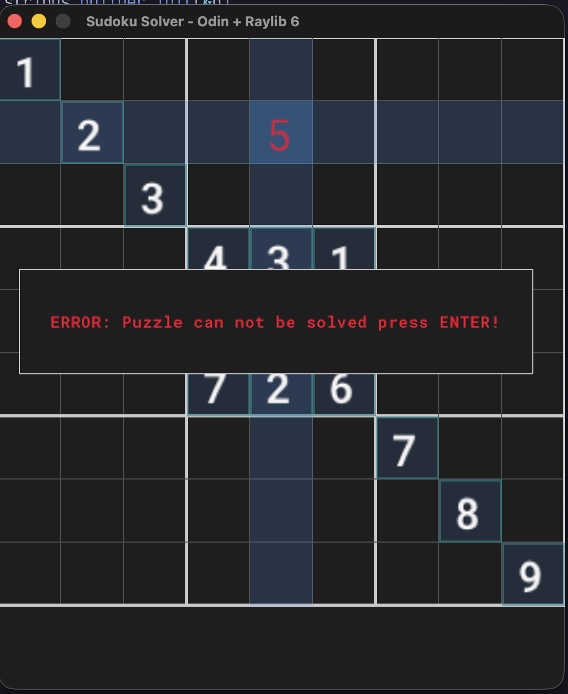
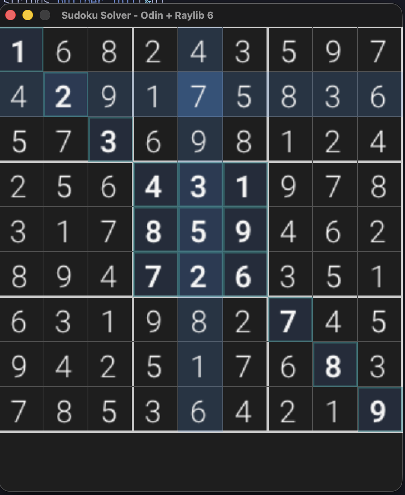

# Sudoku Solver (Odin + Raylib 6)

A clean, interactive Sudoku editor and solver written in [Odin](https://odin-lang.org/) using [Raylib 6](https://www.raylib.com/).

This project is both a useful tool and a learning platform for idiomatic Odin, modular design, and game/app structure.

## Screenshots

<p align="center">
  
  
  
  
  
</p>

## Features

- Full 9×9 grid with clear 3×3 block borders
- Light & dark themes (toggle with `Space`)
- Mouse + keyboard navigation (arrows, WASD, hjkl)
- Tab / Shift+Tab to jump between 3×3 blocks
- Number entry (1-9) and clear (Backspace / Delete)
- Conflict highlighting (row, column, **and** 3×3 box) in red
- Lock / Unlock system (`Ctrl+Shift+L` toggles)
  - Locked cells use bold font + outline
  - `Ctrl+Shift+C` clears all unlocked cells
- Exit confirmation dialog
- Monospaced fonts (Roboto Mono Light + SemiBold)

## Current Status (dev branch)

Package refactor is complete. Feature parity with the pre-refactor app is restored.

### Working
- All gameplay features listed above
- `Game` state, `events` orchestrator, `render`, `helpers`, themes, fonts

### Next
- Save / Load puzzles
- Backtracking solver (locked cells treated as givens)

See `TODO` for the full checklist.

## Controls

| Input                    | Action                              |
|--------------------------|-------------------------------------|
| Mouse click              | Select cell                         |
| Arrows / WASD / hjkl     | Move selection                      |
| Tab / Shift+Tab          | Jump to next/previous 3×3 block     |
| 1-9                      | Enter number                        |
| Backspace / Delete       | Clear cell                          |
| Space                    | Toggle light/dark theme             |
| Ctrl+Shift+L             | Toggle lock on filled cells         |
| Ctrl+Shift+C             | Clear all unlocked cells            |
| Esc                      | Exit confirmation (Y/N)             |

## Building

```bash
make run      # odin run . -collection:src=src
make build    # produces ./sudoku-solver
```

Requires Odin with Raylib 6 and a collection-aware compiler (e.g. dev-2026-08+).

## Project Structure

```text
.
├── main.odin              # entry: game.run()
├── Makefile
├── ols.json               # OLS collection: src
├── TODO
├── assets/fonts/...
└── src/
    ├── game/              # main loop
    ├── state/             # Game struct, constants, init
    ├── events/            # orchestrator + keyboard + mouse
    ├── render/            # grid, numbers, exit dialog
    ├── helpers/           # conflict check, temp_cstring, which_block
    ├── fonts/
    ├── theme/
    ├── logic/             # solver placeholder
    └── vecs/
```

## Roadmap

1. Save / Load puzzles
2. Backtracking solver
3. Undo / Redo (including persistent undofile later)
4. Pencil marks, more themes, microui menus (stretch)
5. WASM / Linux polish

## License

This project is for learning and personal use. Fonts are under the OFL (see `assets/fonts/`).
